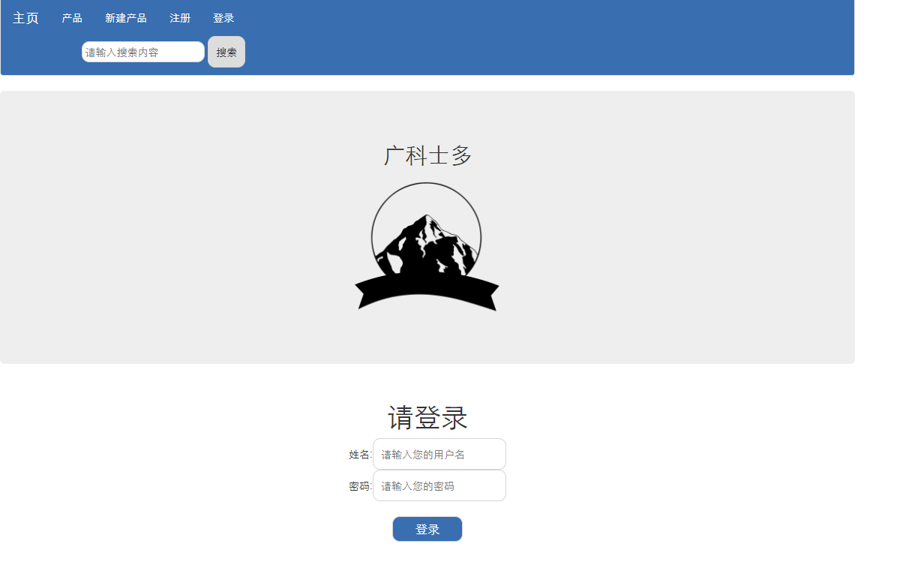
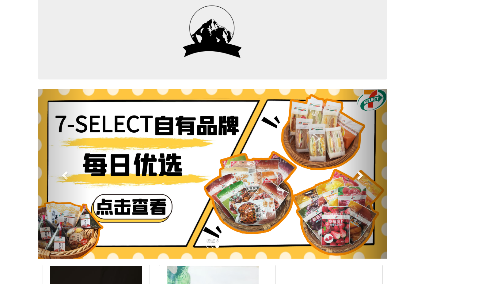
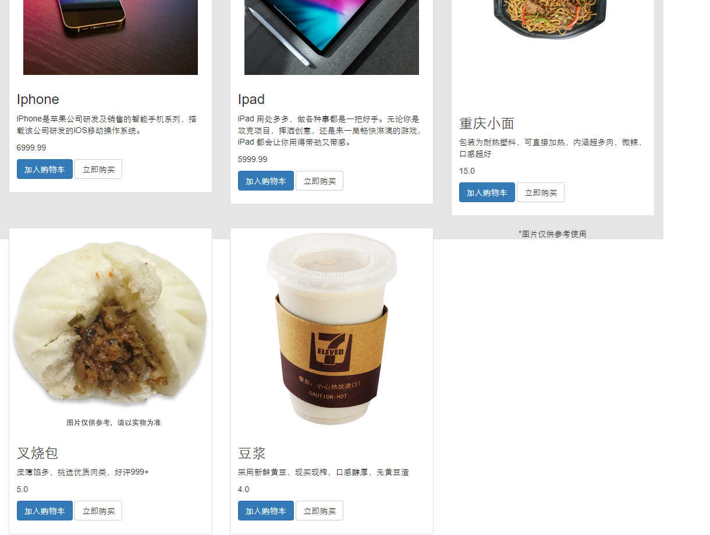

#                  Web应用开发技能大赛

## 一、前言

该项目荣获广州科技职业技术大学职业技能大赛“WEB应用软件开发”赛项院级一等奖和校级三等奖。

## 二、项目介绍

本项目为一虚拟商店的后端管理系统。详见

[《广州科技职业技术大学Web开发竞赛.pdf]: 广州科技职业技术大学Web开发竞赛.pdf

。

### 项目技术栈

前端：HTML/CSS/Javascript、Thymeleaf网页模版引擎、BootStrap框架

后端：Spring Boot、Spring Data JPA、H2数据库

Java版本：1.8

### 三、团队文档说明

这是我们团队第一次参加比赛，在时间仓促的比赛中，可能有很多准备不充分，但是我们分工明确，我们这次的项目是设计的是一个便利店购物网站，网站设计亮点是美观简洁易用，由于时间问题后端有多原因准备不充分，这也是我们下次需要克服的地方，做到追求极致、坦诚清晰等。这个项目具备注册登录搜索引擎这些常见的功能，采用了轮播图展示活动，产品购物简洁好用，能使人直观的购物，以上就是我们的项目亮点。

登录页面简洁好用，给人一种一目了然的感觉。

注册页面即方便又简洁。

轮播图自动播放，使用户更清晰了解活动。

购物模块简单好用。